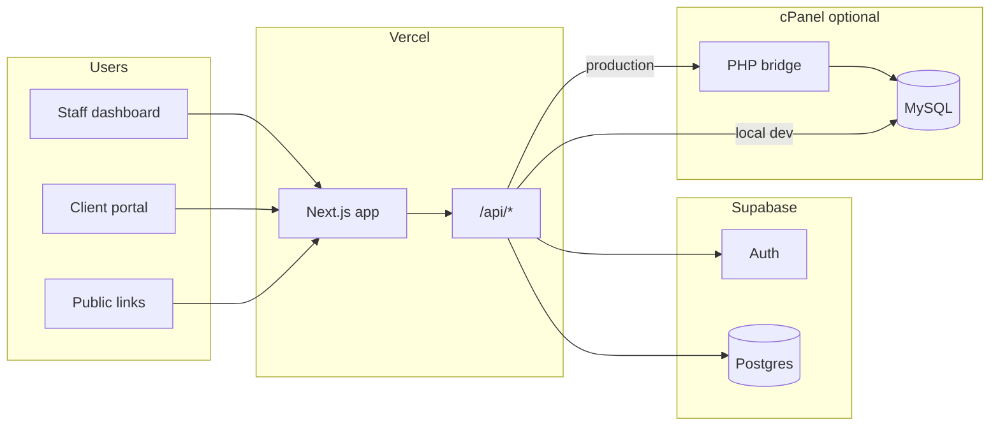

# Invoice CRM Portal

A full-stack client and operations portal for **BMYBrand** — manage invoices, payments, client relationships, team workflows, and structured project briefs from a single Next.js application.

Built for staff dashboards, client self-service, and public shareable links (invoices, brief forms).

---

## Features

### Operations (staff)

- **Dashboard** — role-aware overview and navigation
- **Employees** — team accounts and access control
- **Clients** — client records, registration approvals, and assignments
- **Invoices** — create, send, and track invoices with PDF export
- **Payments** — Stripe checkout and payment intents
- **Brand identity** — brand asset management
- **Client chat** — messaging with attachments and push notifications
- **Brief forms** — distribute intake questionnaires and copy public links for clients
- **Settings** — payment gateways and application configuration

### Client portal

- View invoices and payment history
- Pay invoices via Stripe
- Chat with the team
- Complete and submit brief forms (SEO, website, logo, graphic design, video animation)

### Brief forms

| Form | Purpose |
|------|---------|
| SEO Questionnaire | Campaign goals, audience, competitors, keywords |
| Website | Sitemap, conversions, content, integrations |
| Logo design | Brand direction, references, usage |
| Graphic design | Assets, dimensions, campaign goals |
| Video animation | Script, style, runtime, delivery platforms |

- **Staff** copy a public link and send it to the client; they cannot submit on behalf of clients.
- **Clients** and **public visitors** submit data stored in MySQL (local or via cPanel bridge in production).

---

## Tech stack

| Layer | Technology |
|-------|------------|
| Framework | [Next.js 16](https://nextjs.org/) (App Router) |
| UI | React 19, Tailwind CSS 4 |
| Auth & data | [Supabase](https://supabase.com/) (Auth, Postgres tables) |
| Payments | [Stripe](https://stripe.com/) |
| Email | [Resend](https://resend.com/) |
| Brief form storage | MySQL (`mysql2`) — local dev or **cPanel PHP bridge** on Vercel |
| Hosting | [Vercel](https://vercel.com/) (app) + cPanel (MySQL / PHP bridge) |

---

## Architecture



- **Supabase** — authentication, clients, employees, invoices metadata, chat, and most app data.
- **MySQL** — brief form submissions (`brief_form_submissions` JSON payloads).
- **Production** — Vercel calls the PHP script in `cpanel-bridge/` on your cPanel host so MySQL stays on localhost at the host (no remote MySQL from Vercel).

---

## Prerequisites

- **Node.js** 20+
- **npm** (or pnpm / yarn)
- **Supabase** project (URL, anon key, service role key)
- **Stripe** account (test or live keys + webhook secret)
- **MySQL** for brief forms — either:
  - local/phpMyAdmin for development, or
  - cPanel MySQL + uploaded `cpanel-bridge/` for production

---

## Getting started

### 1. Clone and install

```bash
git clone <repository-url>
cd invoice
npm install
```

### 2. Environment variables

Copy the example file and fill in your values:

```bash
cp .env.example .env.local
```

See [Environment variables](#environment-variables) below.

### 3. Database setup (brief forms)

Run the schema in MySQL (local phpMyAdmin or cPanel phpMyAdmin):

```text
scripts/mysql/brief-forms-schema.sql
```

### 4. Run locally

```bash
npm run dev
```

Open [http://localhost:3000](http://localhost:3000).

---

## Environment variables

| Variable | Required | Description |
|----------|----------|-------------|
| `NEXT_PUBLIC_SUPABASE_URL` | Yes | Supabase project URL |
| `NEXT_PUBLIC_SUPABASE_ANON_KEY` | Yes | Supabase anon / publishable key |
| `SUPABASE_SERVICE_ROLE_KEY` | Yes | Server-side Supabase access |
| `STRIPE_SECRET_KEY` | Yes | Stripe secret key |
| `NEXT_PUBLIC_STRIPE_PUBLISHABLE_KEY` | Yes | Stripe publishable key |
| `STRIPE_WEBHOOK_SECRET` | Yes | Stripe webhook signing secret |
| `RESEND_API_KEY` | Optional | Outbound email |
| `RESEND_FROM_EMAIL` | Optional | Sender address |
| `MYSQL_HOST` | Local | MySQL host (development) |
| `MYSQL_PORT` | Local | MySQL port (default `3306`) |
| `MYSQL_USER` | Local | MySQL username |
| `MYSQL_PASSWORD` | Local | MySQL password |
| `MYSQL_DATABASE` | Local | Database name |
| `CPANEL_BRIEF_FORMS_BRIDGE_URL` | Production | Full URL to `brief-forms.php` on cPanel |
| `CPANEL_BRIEF_FORMS_BRIDGE_SECRET` | Production | Shared secret (must match `config.php` on server) |
| `NEXT_PUBLIC_BRIEF_FORMS_PUBLIC_BASE_URL` | CRM deploy | Brand site base URL for staff **Copy Link** (e.g. `https://bmybrand.vercel.app`) |

> **Note:** If both `CPANEL_BRIEF_FORMS_BRIDGE_*` and `MYSQL_*` are set, the **cPanel bridge is used first**. For local development, use only `MYSQL_*`.

### Brand site + CRM (two Vercel projects)

| Project | Repo path | Role |
|---------|-----------|------|
| **Brand** | `Bmybrand/rebranding/bmybrand` | Marketing site (`bmybrand.vercel.app`) |
| **CRM** | `invoice_portal/invoice` | Staff dashboard + brief form UI + API |

1. **CRM Vercel** — set `NEXT_PUBLIC_BRIEF_FORMS_PUBLIC_BASE_URL=https://bmybrand.vercel.app` so **Copy Link** uses the brand domain.
2. **Brand Vercel** — set `INVOICE_PORTAL_ORIGIN` to your **CRM** production URL (e.g. `https://your-invoice-crm.vercel.app`). The brand app serves `/brief-forms/*` pages that embed the CRM form (iframe). Use the CRM URL here, not `bmybrand.vercel.app`.

Both deployments need the same Supabase and cPanel bridge env vars so public forms can submit.

**404 on brand links?** Deploy the latest **bmybrand** code (includes `app/brief-forms/[formType]`). On the **bmybrand** Vercel project (not CRM), set `INVOICE_PORTAL_ORIGIN` to your CRM production URL and redeploy. If you see “Brief form is not configured”, the env var is missing or points at the wrong host.

---

## Deployment

### Vercel (application)

1. Import the repository into Vercel.
2. Add all required environment variables from `.env.example`.
3. Set `CPANEL_BRIEF_FORMS_BRIDGE_URL` and `CPANEL_BRIEF_FORMS_BRIDGE_SECRET` (do not rely on remote MySQL from Vercel unless your host explicitly allows it).
4. Deploy and configure the Stripe webhook URL to  
   `https://<your-domain>/api/webhooks/stripe`.

### cPanel (brief form storage)

1. Create a MySQL database and user in cPanel.
2. Import `scripts/mysql/brief-forms-schema.sql` in phpMyAdmin.
3. Upload the `cpanel-bridge/` folder to your host (e.g. `public_html/cpanel-bridge/`).
4. Copy `cpanel-bridge/config.sample.php` to `cpanel-bridge/config.php` and set database credentials and `bridge_secret`.
5. Confirm the endpoint responds (401 without a secret is expected):

   `https://yourdomain.com/cpanel-bridge/brief-forms.php`

6. Add the same URL and secret to Vercel environment variables and redeploy.

The `.htaccess` in `cpanel-bridge/` blocks direct web access to `config.php`.

---

## Scripts

| Command | Description |
|---------|-------------|
| `npm run dev` | Start development server |
| `npm run build` | Production build |
| `npm run start` | Run production server locally |
| `npm run lint` | Run ESLint |

---

## Project structure

```text
├── cpanel-bridge/          # PHP API for MySQL on cPanel (production)
├── scripts/mysql/          # SQL schema for brief forms
├── src/
│   ├── app/                # Next.js App Router (pages & API routes)
│   ├── components/         # UI components (dashboard, forms, invoices)
│   └── lib/                # Shared logic (auth, Stripe, brief form storage)
├── middleware.ts           # Auth guards for dashboard & API
└── .env.example            # Environment template
```

---

## API overview (brief forms)

| Method | Path | Access |
|--------|------|--------|
| `POST` | `/api/brief-forms` | Clients and public (staff blocked) |
| `GET` | `/api/brief-forms` | Admin / super admin |

Submissions are stored as JSON in `brief_form_submissions` with `form_type`, `submitter_email`, `source`, and timestamps.

---

## Security notes

- Never commit `.env`, `.env.local`, or `cpanel-bridge/config.php`.
- Use a long random value for `CPANEL_BRIEF_FORMS_BRIDGE_SECRET`.
- Rotate Stripe and Supabase keys if they are ever exposed.
- Brief form POST is public by design for client links; staff submission is blocked in the UI and API.

---

## License

Private — All rights reserved. Unauthorized distribution is prohibited unless otherwise agreed with the project owner.
